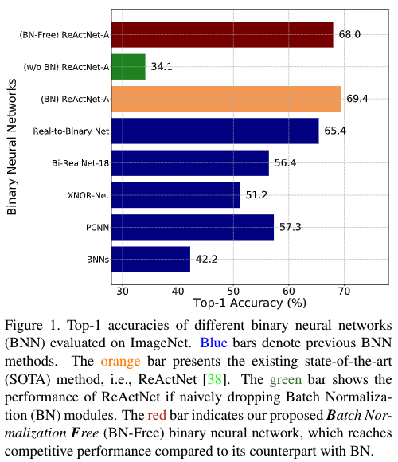
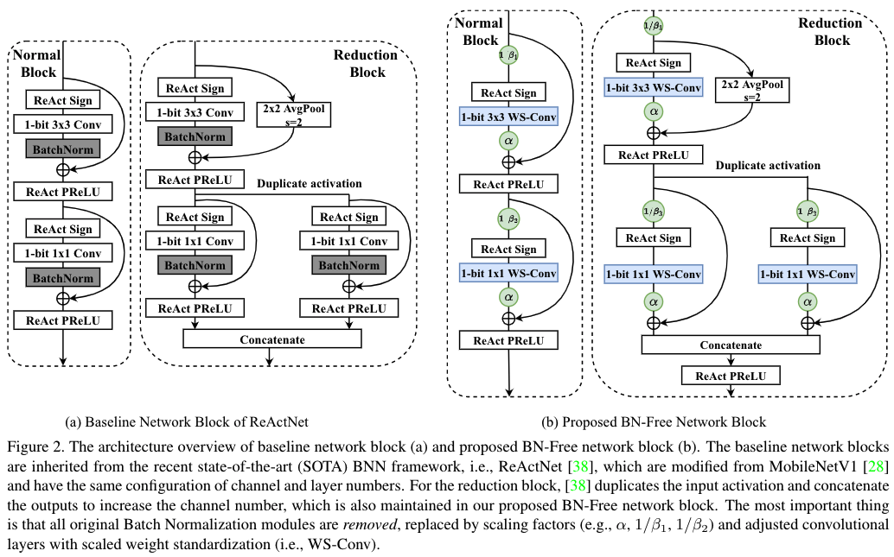

# BNN - BN = ? Training Binary Neural Networks without Batch Normalization

[](https://opensource.org/licenses/MIT)

Codes for this paper [BNN - BN = ? Training Binary Neural Networks without Batch Normalization](). [CVPR BiVision Workshop 2021]

Tianlong Chen, Zhenyu Zhang, Xu Ouyang, Zechun Liu, Zhiqiang Shen, Zhangyang Wang.


## Overview

Batch normalization (BN) is a key facilitator and considered essential for state-of-the-art binary neural networks (BNN). However, the BN layer is costly to calculate and is typically implemented with non-binary parameters, leaving a hurdle for the efficient implementation of BNN training. It also introduces undesirable dependence between samples within each batch.

Inspired by the latest advance on Batch Normalization Free (BN-Free) training, we extend their framework to training BNNs, and for the first time demonstrate that BNs can be completed removed from BNN training and inference regimes. By plugging in and customizing techniques including adaptive gradient clipping, scale weight standardization, and specialized bottleneck block, a **BN-free BNN** is capable of maintaining competitive accuracy compared to its BN-based counterpart. Experimental results can be found in [our paper]().




## BN-Free Binary Neural Networks




## Reproduce

### Environment

```
pytorch == 1.5.0
torchvision == 0.6.0
timm == 0.4.5
```

### Training on ImageNet

```
./script/imagenet_reactnet_A_bf.sh (BN-Free ReActNet-A)
./script/imagenet_reactnet_A_bn.sh (with BN ReActNet-A)
./script/imagenet_reactnet_A_none.sh (without BN ReActNet-A)
```


## Citation

```
TBD
```


## Acknowledgement

https://github.com/liuzechun/ReActNet

https://github.com/liuzechun/Bi-Real-net

https://github.com/vballoli/nfnets-pytorch

https://github.com/deepmind/deepmind-research/tree/master/nfnets